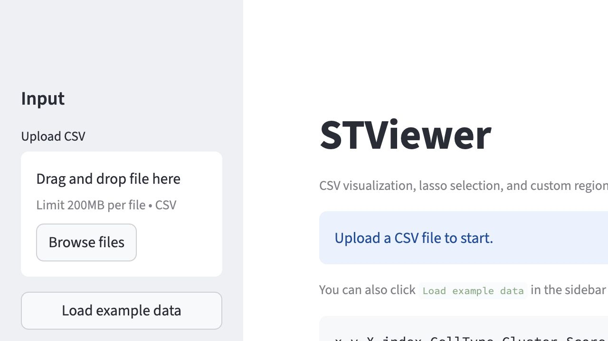
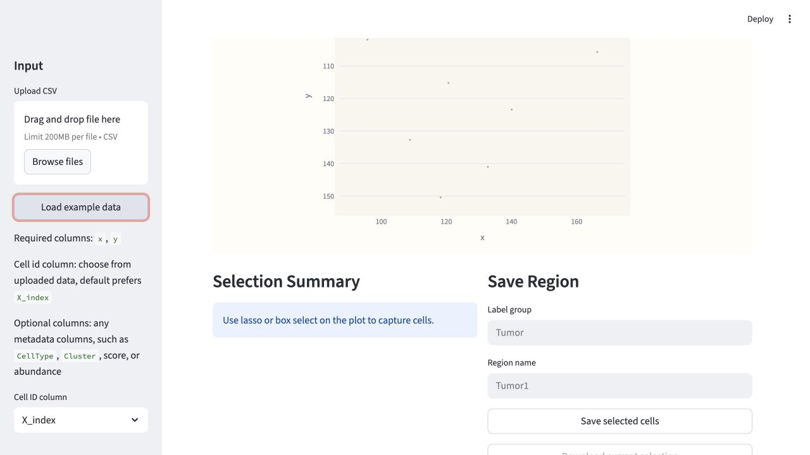

# STViewer Tutorial

## Overview

STViewer is a lightweight local viewer for spatial transcriptomics CSV data.

It is designed for:

- plotting cells by real spatial coordinates
- coloring cells by metadata columns
- manually selecting regions
- exporting selected cells and saved regions as CSV

## Interface Preview

Initial view:



Example data loaded:



## Input File

STViewer currently supports:

- `.csv`

### Required Columns

- `x`: x coordinate
- `y`: y coordinate

### Cell ID Column

The cell ID column is chosen by the user after loading the file.

Rules:

- the app asks the user to select one column as `cellid`
- if `X_index` exists, it is selected by default
- any non-coordinate column can be used if needed

Common examples:

- `X_index`
- `cellid`
- `CellID`
- `barcode`

### Optional Metadata Columns

All extra columns are treated as optional metadata columns and can be used for:

- color display
- filtering
- selection interpretation

Examples:

- `CellType`
- `Cluster`
- `MajorType`
- `sample`
- `Score`
- `abundance`

### Input Rules

- rowname-like columns such as `Unnamed: 0` are ignored automatically
- `x` and `y` are converted to numeric values
- rows with invalid `x` or `y` are removed automatically
- metadata column names are not fixed
- both categorical and continuous variables are supported

### Example Input

```csv
x,y,X_index,CellType,Cluster,Score
102.5,88.1,cell_001,T_cell,C1,0.82
110.2,92.4,cell_002,T_cell,C1,0.76
95.8,101.9,cell_003,B_cell,C2,0.31
120.7,115.2,cell_004,Fibroblast,C3,0.55
```

You can test the bundled example file:

```text
examples/example_spatial.csv
```

You can also click `Load example data` in the sidebar to open this example without uploading a file manually.

## Main Functions

### 1. Spatial Plot

The main plot displays cells using the real `x:y` coordinate ratio.

Supported interactions:

- zoom
- pan
- hover
- lasso select
- box select

Display options:

- point size adjustment
- y-axis inversion
- metadata-based coloring

### 2. Color Display

If no color column is selected:

- cells are shown in gray

If a categorical column is selected:

- cells are shown with discrete colors
- each category color can be changed interactively
- hex colors such as `#E64B35` are supported

If a continuous column is selected:

- cells are shown with a continuous color scale

### 3. Filtering

You can filter visible cells by one categorical metadata column.

Typical uses:

- show one sample only
- focus on one cell lineage
- reduce clutter before manual region selection

### 4. Region Selection

You can use lasso or box selection on the main plot.

After selection, the app shows:

- selected cell count
- top categories for the current color column
- optional preview of selected rows

### 5. Region Saving

To save one selected region:

1. Enter a `Label group`, such as `Tumor`
2. Enter a `Region name`, such as `Tumor1`
3. Click `Save selected cells`

One label group can contain multiple regions:

- `Tumor1`
- `Tumor2`
- `Tumor3`

### 6. Saved Region Preview

Saved regions can be previewed in a second plot.

They can be colored by:

- `region_label`
- `label_group`
- `region_name`

This helps check whether the saved regions match the intended tissue areas.

## Output Files

STViewer provides two CSV exports.

### Current Selection Export

File name:

- `selected_cells.csv`

Columns:

- `cellid`
- `label_group`
- `region_name`

Meaning:

- contains only the currently selected cells

### All Saved Regions Export

File name:

- `annotated_regions.csv`

Columns:

- `cellid`
- `label_group`
- `region_name`

Meaning:

- contains all saved regions in the current session

### Example Output

```csv
cellid,label_group,region_name
cell_001,Tumor,Tumor1
cell_002,Tumor,Tumor1
cell_010,Tumor,Tumor2
```

## Basic Workflow

1. Start STViewer
2. Upload a CSV file or click `Load example data`
3. Choose the cell ID column
4. Choose a metadata column for coloring
5. Adjust point size or filter if needed
6. Select cells with lasso or box
7. Save the region with `Label group` and `Region name`
8. Download the current selection or all saved regions

## Startup Methods

Editable install:

```bash
stviewer
```

Project script:

```bash
bash scripts/start.sh
```

Direct Streamlit run:

```bash
python3 -m streamlit run src/stviewer/app.py --server.port 8501
```

## Notes

- the app is intended for local use on Linux or macOS
- very large CSV files may still need further optimization in future versions
